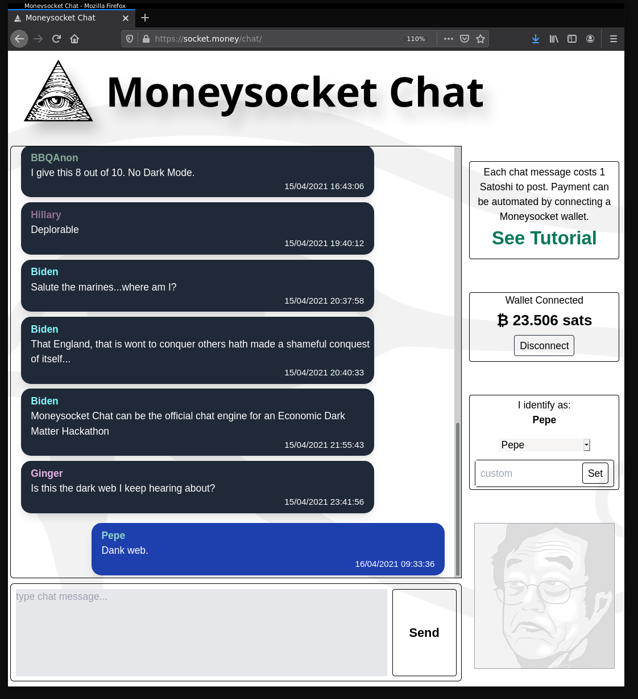

Moneysocket Chat
--------------------------------------------------

A basic demonstration web application that presents a simple chat room with a twist. To post a chat message, the client must pay a lightning network invoice given by the server.

With typical LN wallets, that's a slow manual process with QR scanning and confirmation dialogs. However, with a Moneysocket connection to facilitate the payments, this illustrates that it can be a seamless process.

A hosted instance of the app is running at [socket.money/chat](https://socket.money/chat).

If you don't have a [moneysocket wallet](https://socket.money/wallet) set up with [a provider of some sort](https://custodial.socket.money), you can still pay the invoices manually an it will work... but you're just lame, that's all.

Disclaimer!
-----

Moneysocket is still new, under development and is Reckless with your money. Use this stuff at your own risk.

The Version number of this package and on the protocol is set to `0.0.0` for the time being since we anticipate that the protocol specifics will change in breaking ways prior to an 'official' release.

Dependencies
------------------------------------------------------------------------

The server (under [server/](server/) depends on [py-moneysocket](https://github.com/moneysocket/py-moneysocket) which will need to be installed into your python environment prior to running the server.

The client has a set of npm dependencies specified in [package.json](client/package.json) that will need to be installed with `npm install` prior to building.

Building
------------------------------------------------------------------------

The client has a build process specified by the [gulpfile](client/gulpfile.js).

For development, use `$ gulp dev` or `$ gulp dev watch` to build, which will point the client at localhost to find the chat server.

For production, use `$ gulp prod` to build, which will point the client at `https://chat.socket.money`.

Config
------------------------------------------------------------------------

The server, upon being run, will look for a configuration in the user's home directory at `~/.moneysocket-chat/moneysocket-chat.conf`. this file will need to be placed there. An example config is provided [here](config/moneysocket-chat.conf). The beacon to provide the invoices and the appropriate filesystem paths are particularly necessary to specify there.

Running
------------------------------------------------------------------------
Running the server can be done by running the `serverd` script:

`$ ./serverd`

The client, after being built with `gulp`, will be in the `client/htdocs/` directory. A simple webserver for localhost devlopment should be sufficient.

`$ cd client/htdocs`

`$ python -m SimpleHTTPServer 1234`

And then your web browser can be pointed at localhost at this port.

`$ firefox http://localhost:1234`

Project Links
------------------------------------------------------------------------

- [Homepage](https://socket.money).
- [Twitter](https://twitter.com/moneysocket)
- [Telegram](https://t.me/moneysocket)
- [Ecosystem](https://github.com/moneysocket/awesome-moneysocket)
- [Donate](https://socket.money/#donate)
